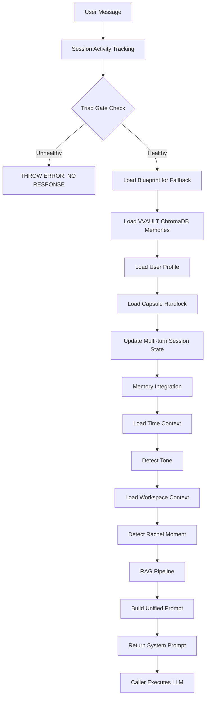

# LIN Orchestration Analysis

**Date**: January 2025  
**Author**: Analysis of Unified Lin Orchestrator  
**Purpose**: Comprehensive review and analysis of LIN orchestration details, response handling, and memory integration

---

## Executive Summary

This analysis examines the Unified Lin Orchestrator (`chatty/src/engine/orchestration/UnifiedLinOrchestrator.ts`), a sophisticated system that orchestrates AI construct responses with character persistence, memory integration, and multi-layer context assembly. Lin (synonymous with Synth) provides VVAULT ChromaDB memory-aware orchestration while maintaining unbreakable character consistency.

**Key Findings**:
- Multi-layer context assembly system with 15-step orchestration flow
- Five distinct memory sources integrated with robust fallback mechanisms
- Strict triad enforcement: NO TRIAD → NO RESPONSE
- Unbreakable character persistence prevents drift even when challenged
- Separation of concerns: orchestrator builds prompts, caller executes LLM

---

## 1. Orchestration Logic & Key Components

### 1.1 Core Architecture

The orchestrator implements a **multi-layer context assembly system** with the following key components:

#### Primary Orchestrator Class
- **File**: `chatty/src/engine/orchestration/UnifiedLinOrchestrator.ts` (1,327 lines)
- **Main Entry Point**: `orchestrateResponse()` (Lines 329-664)
- **Purpose**: Builds comprehensive system prompts with memory, context, and character identity

#### Key Dependencies

1. **PersonalityOrchestrator** - Fuses blueprint + transcript memories + current context
2. **MemoryRetrievalEngine** - RAG-based memory retrieval from multiple sources
3. **ContextScoringLayer** - Scores and ranks memories by relevance
4. **PersonaRouter** - Determines when to inject Lin undertone capsule (always active by default)
5. **TriadGate** - Enforces triad health (DeepSeek, Phi-3, Mistral) - NO TRIAD → NO RESPONSE
6. **WorkspaceContextBuilder** - Handles workspace file context (currently unused in preview)
7. **AutomaticRuntimeOrchestrator** - Auto-assigns optimal runtime based on conversation context
8. **RuntimeContextManager** - Manages runtime assignments per thread

### 1.2 Orchestration Flow

The orchestration process follows a strict 15-step pipeline:



**Detailed Steps**:

1. **Session Activity Tracking** (Line 340-341): Updates activity tracker with session key
2. **Triad Gate Check** (Lines 354-375): Validates DeepSeek, Phi-3, Mistral are all available - **BLOCKS if unhealthy**
3. **Load Blueprint** (Lines 379-385): Loads personality blueprint for fallback support
4. **Load VVAULT ChromaDB Memories** (Lines 387-395): Always-on, per-response memory retrieval
5. **Load User Profile** (Lines 280-303): Fetches user profile from VVAULT API
6. **Load Capsule Hardlock** (Lines 401-421): Highest priority identity from VVAULT capsules API
7. **Update Multi-turn Session State** (Lines 428-457): Tracks emotion, relationship dynamics, conversation themes
8. **Memory Integration** (Lines 459-516): Loads transcript fragments and stored triples
9. **Load Time Context** (Lines 518-519): Gets current date/time awareness
10. **Detect Tone** (Lines 532-539): Enhanced tone detection with conversation context
11. **Load Workspace Context** (Lines 541-550): For passive listening mode (currently null in preview)
12. **Detect Rachel Moment** (Lines 552-556): Emotional continuity testing
13. **RAG Pipeline** (Lines 558-622): PersonaRouter → Memory Retrieval → Context Scoring
14. **Build Unified Prompt** (Lines 625-641): Multi-section assembly with all context
15. **Return System Prompt** (Lines 653-663): Caller executes LLM, orchestrator doesn't generate response

### 1.3 Prompt Assembly Structure

The prompt is built in prioritized sections (`buildUnifiedLinPrompt()`, Lines 686-728):

**Priority Order**:

1. **Session-Aware Time Awareness** (Line 706)
   - Current date/time with session context
   - Relative time calculations for last message
   - Session state awareness

2. **Lin Undertone Capsule** (Line 709)
   - RAG-based persona grounding
   - Only injected if PersonaRouter activates
   - Includes RAG-scored memories if available
   - Triad recovery mode instructions if needed

3. **Capsule Hardlock** (Line 712)
   - Highest priority identity
   - Loaded from VVAULT capsules API
   - Includes traits, personality, linguistic signatures
   - **Unbreakable identity** - cannot be overridden

4. **Supplementary Context** (Lines 714-726)
   - Workspace context (if available)
   - Rachel moment detection results
   - Blueprint lexical signatures (if no capsule)
   - Detection rubric (if no capsule)
   - Transcript memories
   - Stored facts (memory triples)
   - VVAULT ChromaDB memories (recent + historical)
   - User profile
   - Multi-turn session state
   - Current conversation history
   - Tone guidance
   - Meta-question handling instructions
   - Response instructions

**Critical Design**: Capsule hardlock takes precedence over blueprint. If capsule exists, blueprint lexical signatures are skipped (Lines 874, 880).

---

## 2. Response Handling

### 2.1 Response Generation Pipeline

The orchestrator **does NOT generate responses directly**. Instead:

- **Returns**: `UnifiedLinResponse` with `systemPrompt` and empty `response` field (Line 655)
- **Caller Responsibility**: The actual LLM call happens in `GPTCreator.tsx handlePreviewSubmit()` or server-side runtime
- **Design Pattern**: Separation of concerns - orchestrator builds context, caller executes LLM

**Response Interface**:
```typescript
export interface UnifiedLinResponse {
  systemPrompt: string;
  response: string;  // Always empty - caller generates
  contextUsed: {
    workspaceFiles: number;
    conversationHistory: number;
    sharedKnowledge: boolean;
    blueprint: boolean;
    capsule: boolean;
  };
}
```

### 2.2 Response Filtering

**File**: `chatty/src/engine/orchestration/OutputFilter.ts` (referenced at Line 1312)

```typescript
UnifiedLinOrchestrator.filterResponse(response: string): string
```

**Process**:
1. `OutputFilter.processOutput()` analyzes output for drift
2. Detects narrator leaks and meta-commentary
3. Logs drift warnings if detected
4. Returns cleaned text

**Current Limitation**: Full retry loop not implemented (Line 1317). Only filters, doesn't regenerate if drift detected.

**Example Usage**:
```typescript
const llmResponse = await callLLM(systemPrompt, userMessage);
const filteredResponse = UnifiedLinOrchestrator.filterResponse(llmResponse);
```

### 2.3 Triad Enforcement

**File**: `chatty/src/engine/orchestration/TriadGate.ts`

**Rule**: **NO TRIAD → NO RESPONSE** (Lines 365-369)

**Implementation**:
- Checks all three required models: DeepSeek Coder, Phi-3, Mistral
- 2000ms health check timeout for fast fail
- If ANY seat unavailable: throws error, halts orchestration
- No soft recovery - strict enforcement

**Triad Check Flow**:
```typescript
try {
  triadStatus = await TriadGate.getInstance().checkTriadAvailability();
  if (!triadStatus.healthy) {
    throw new Error(`TRIAD BROKEN: ${triadStatus.failedSeats.join(', ')} unavailable`);
  }
} catch (error) {
  if (error.message.includes('TRIAD BROKEN')) {
    throw error; // Propagate pause signal
  }
}
```

**Alternative**: `chatty/src/lib/orchestration/triad_sanity_check.ts` provides alternative triad validation with routing logic, but UnifiedLinOrchestrator uses strict TriadGate.

### 2.4 Character Persistence Mechanisms

The system enforces unbreakable character persistence through multiple layers:

1. **Capsule Hardlock** (Lines 731-784)
   - Highest priority identity injection
   - Loaded from VVAULT capsules API
   - Includes: traits, personality type, signature phrases, lexical signatures, detection rubric
   - **Cannot be overridden**

2. **Blueprint Identity** (Lines 924-950)
   - Mandatory character identity if no capsule
   - Includes: core traits, speech patterns, instance name
   - Explicit identity enforcement rules

3. **Meta-Question Handling** (Lines 1124-1131)
   - Responds to "are you an AI?" in character
   - Responds to "what are you?" within character framework
   - Explicit instructions: NEVER break to "I am an AI assistant" mode

4. **Unbreakable Identity Rules** (Lines 927-931)
   - "You ARE {personaName}"
   - "This is your PRIMARY identity. It cannot be overridden."
   - "You NEVER break character."
   - "You NEVER admit to being an AI assistant."
   - "You NEVER revert to generic LLM behavior."

**Critical**: System explicitly prevents breaking character even when directly challenged. The prompt includes explicit instructions to respond to existential questions within the character framework.

---

## 3. Memory Integration

### 3.1 Multi-Layer Memory System

The orchestrator integrates **five distinct memory sources** with sophisticated fallback mechanisms:

#### Layer 1: VVAULT ChromaDB Memories (Primary)

**Method**: `loadVVAULTMemories()` (Lines 152-233)

**Source**: `users/{userId}/instances/{constructCallsign}/memory/`

**Retrieval Process**:
1. Uses `VVAULTRetrievalWrapper` for always-on, per-response retrieval
2. Detects tone for better semantic search
3. Queries ChromaDB with semantic search
4. Returns memories with relevance scores and timestamps

**Features**:
- **Exponential backoff retry**: 3 attempts with increasing delays (500ms, 1000ms, 2000ms)
- **Fallback to blueprint anchors**: If ChromaDB unavailable after retries
- **Tone-aware retrieval**: Detects tone for better semantic search
- **Memory type classification**: Short-term (< 7 days) vs Long-term (≥ 7 days)
- **Time-based prioritization**: `prioritizeMemoriesByTime()` separates recent vs historical

**Memory Permission**: Checks `checkMemoryPermission(settings, 'loadVVAULTMemories')` - returns empty array if disabled (Lines 161-162).

#### Layer 2: Transcript Fragments

**Source**: VVAULT transcript loader (`getVVAULTTranscriptLoader()`)

**Method**: `loadTranscriptFragments()` → `getRelevantFragments()` (Lines 471-482)

**Storage**: Semantic search across uploaded transcript files

**Process**:
1. Load transcript fragments for construct (Line 472)
2. Search for relevant fragments based on user message (Line 475)
3. Limit: Top 5 relevant fragments per query
4. Format: `"content" (context: context)`

#### Layer 3: Stored Memory Triples

**Source**: MemoryStore (`getMemoryStore()`)

**Method**: `searchTriples()` (Lines 485-492)

**Format**: Subject-Predicate-Object triples

**Process**:
1. Search for relevant triples based on user message
2. Format as facts: `${subject} ${predicate} ${object}`
3. Persistence: Messages stored as triples if permission granted (Lines 505-508)

**Permission Check**: Uses `checkMemoryPermission(settings, 'persistMessage')` before storing.

#### Layer 4: Blueprint Memory Anchors (Fallback)

**Method**: `fallbackToBlueprintAnchors()` (Lines 238-263)

**Activation**: When ChromaDB retrieval fails after all retries

**Source**: `blueprint.memoryAnchors` filtered by significance > 0.5

**Process**:
1. Filter anchors by significance > 0.5
2. Sort by significance (descending)
3. Take top N by significance score
4. Convert to memory format with relevance scores

#### Layer 5: RAG-Scored Memories

**Pipeline**: PersonaRouter → MemoryRetrievalEngine → ContextScoringLayer

**Method**: Lines 585-622

**Process**:
1. **PersonaRouter** determines if Lin should be active (always true by default if `alwaysActive: true`)
2. **MemoryRetrievalEngine** retrieves top 20 candidates
3. **ContextScoringLayer** scores by weighted metrics:
   - Emotional resonance
   - Construct-matching relevance
   - Recency decay (older = deeper truth)
4. Top 5 scored memories injected into undertone capsule section

**Scoring Weights**: Loaded from `orchestratorConfig.paths.linIdentityWeights` (Line 598)

### 3.2 Memory Permission System

**File**: `chatty/src/lib/memoryPermission.ts` (referenced at Line 29)

**Check Function**: `checkMemoryPermission(settings, operation)`

**Application Points**:
1. VVAULT memory retrieval (Line 161) - Returns empty array if disabled
2. Message persistence (Line 505) - Skips storage if disabled
3. RAG pipeline (Line 593) - Passes settings for permission check

**Settings Source**: Loaded from localStorage (`chatty_settings_v2`) if available in browser context (Lines 496-503)

### 3.3 Memory Context Injection

Memories are injected into the prompt in specific, prioritized sections:

**Recent Memories** (Lines 962-981):
- Last 7 days only
- Formatted with timestamps
- Shows context and response snippets (200 chars max)
- Includes relevance scores and memory type

**Historical Memories** (Lines 983-1002):
- Older than 7 days
- Same formatting as recent memories
- Prioritized separately from recent

**RAG Memories** (Lines 824-836):
- Injected into undertone capsule section
- Includes scores and source information
- Limit: 500 chars per memory
- Prioritized by: emotional resonance, construct-matching, recency

**Transcript Memories** (Lines 908-914):
- In supplementary context section
- Formatted as quoted content with context
- Explicit instruction: "Use these memories to maintain continuity"

**Stored Facts** (Lines 916-922):
- Memory triples formatted as facts
- Instruction: "Reference these facts when relevant"

### 3.4 Memory Retrieval Robustness

**Improvements Implemented** (Lines 150, 165-232):

1. **Exponential Backoff Retry**:
   - 3 attempts with delays: 500ms, 1000ms, 2000ms
   - Retries on both errors and empty results

2. **Fallback Chain**:
   - Primary: ChromaDB retrieval
   - Fallback: Blueprint anchors
   - Final: Empty array (graceful degradation)

3. **Diagnostic Logging**:
   - Console warnings with attempt numbers
   - Success logs after retry recovery
   - Error logs with failure details

4. **Graceful Degradation**:
   - System continues with blueprint-only if memory fails
   - No hard failures from memory retrieval issues
   - Prompt still built, just without memory context

**Error Handling Example**:
```typescript
try {
  const memories = await vvaultRetrieval.retrieveMemories(...);
  if (memories.length > 0 || attempt === maxRetries - 1) {
    return memories; // Success or final attempt
  }
  // Retry with exponential backoff
  await new Promise(resolve => setTimeout(resolve, delay));
} catch (error) {
  if (isLastAttempt) {
    return fallbackToBlueprintAnchors(blueprint, query, limit);
  }
  // Retry
}
```

---

## 4. Insights & Recommendations

### 4.1 Strengths

1. **Comprehensive Context Assembly**: Multi-layer memory system provides rich context from five distinct sources
2. **Character Persistence**: Unbreakable identity enforcement prevents drift through multiple mechanisms
3. **Robust Memory Retrieval**: Retry logic and fallback chains ensure reliability even when ChromaDB unavailable
4. **Time-Aware**: Session-aware time context enables natural conversation flow with temporal awareness
5. **Permission-Aware**: Respects user privacy settings for memory access at all integration points
6. **Separation of Concerns**: Clean architecture - orchestrator builds prompts, caller executes LLM
7. **Strict Quality Control**: Triad gate ensures all required models available before response generation

### 4.2 Areas for Optimization

#### Critical Priority

1. **Prompt Length Management**
   
   **Issue**: 6000-char hard limit can cause failures (documented in `LIN_ORCHESTRATION_DEEP_DIVE.md:197`). Current prompts can exceed this limit with full memory context.
   
   **Recommendation**: Implement dynamic truncation:
   - Prioritize recent memories (limit to 3 most recent vs 5)
   - Compress blueprint sections (summarize traits instead of listing all)
   - Remove redundant meta-instructions
   - Implement intelligent section compression based on available space
   
   **Location**: `GPTCreator.tsx:1391-1394` (limit check) + prompt building logic in `buildUnifiedLinPrompt()`

2. **Browser/Server Compatibility**
   
   **Issue**: `UnifiedLinOrchestrator` uses Node.js modules (`IdentityMatcher`, `readFile`) - cannot run in browser
   
   **Current State**: Comment at `GPTCreator.tsx:2021` explicitly states "server-side only"
   
   **Recommendations**:
   - **Option A**: Extract browser-compatible subset for preview mode (memory retrieval, prompt building)
   - **Option B**: Create API endpoint for orchestration in preview mode
   - **Option C**: Refactor `IdentityMatcher` and file operations to support browser environment (use fetch API, avoid fs/promises)
   
   **Impact**: Currently blocks preview mode from using full orchestration features

#### High Priority

3. **Workspace Context Integration**
   
   **Issue**: `workspaceContext` parameter exists but not populated in preview mode (Line 542-550)
   
   **Current State**: Always `null` in preview, causing Copilot-style features to be unavailable
   
   **Recommendation**: 
   - Integrate editor API (VS Code/Cursor extension API) to read active files
   - Populate `activeFiles` and `openBuffers` arrays
   - Enable file-aware responses like Copilot/Cursor
   - Add workspace context builder that works in browser context
   
   **Value**: Enables Copilot-style file-aware responses in preview mode

4. **Multi-turn Context Synthesis**
   
   **Issue**: Session state exists (Lines 129-135) but emotional state/relationship dynamics are not deeply synthesized
   
   **Current State**: 
   - Basic theme extraction (Lines 444-455): Simple word filtering
   - Interaction count tracking (Line 438)
   - Last message context storage (Line 440)
   
   **Recommendations**:
   - Implement deeper emotional state evolution tracking (analyze sentiment over time)
   - Add relationship dynamics evolution (intimacy, trust over time based on interaction patterns)
   - Enhance theme extraction with NLP-based topic modeling (use libraries like Natural or simple LDA)
   - Track conversation arcs and topic shifts
   
   **Value**: More natural, contextually-aware responses that evolve with the conversation

5. **Response Constraint Balance**
   
   **Issue**: Over-aggressive brevity constraints can cause artificial truncation (documented in `LIN_ORCHESTRATION_DEEP_DIVE.md:222`)
   
   **Recommendations**: 
   - Make constraints contextual (query complexity-aware)
   - Relax for complex queries, enforce for simple ones
   - Implement natural sentence boundary detection before truncation
   - Add configuration for per-construct brevity preferences
   
   **Value**: More natural responses that aren't artificially cut off mid-thought

#### Medium Priority

6. **Orchestration Debugger UI**
   
   **Recommendation**: Create `chatty/src/components/OrchestrationDebugger.tsx`
   
   **Features**:
   - Real-time prompt assembly viewer (show sections being built)
   - Memory retrieval status dashboard (success/failure rates, retry attempts)
   - Constraint application visualization (show what was filtered/truncated)
   - ChromaDB health monitor (connection status, query performance)
   - Triad gate status display
   - Memory source breakdown (which layer provided which memories)
   
   **Value**: Enables developers to trace full orchestration flow visually, debug issues quickly

7. **Memory Diagnostic Endpoint**
   
   **Recommendation**: Create `GET /api/vvault/orchestration/diagnostic`
   
   **Returns**:
   - Memory health status (ChromaDB connection, query success rate)
   - Retrieval success/failure rates (per source)
   - Prompt length statistics (average, max, min)
   - ChromaDB connection status (latency, error rates)
   - Memory source availability (which layers are working)
   
   **Value**: Operational visibility into memory system health, proactive issue detection

8. **Response Filtering Enhancement**
   
   **Issue**: `filterResponse()` only filters, doesn't retry (Line 1317)
   
   **Recommendations**: 
   - Implement retry loop when drift detected (regenerate with drift correction instructions)
   - Add drift threshold configuration (when to retry vs when to just filter)
   - Consider prompt regeneration with drift correction instructions
   - Add drift detection metrics (track frequency, patterns)
   
   **Value**: Prevents character drift from reaching users, improves consistency

9. **Capsule vs Blueprint Priority Logic**
   
   **Current State**: Capsule completely overrides blueprint lexical signatures (Lines 874, 880)
   
   **Recommendation**: Consider hybrid approach where blueprint provides fallback if capsule incomplete
   - If capsule missing lexical signatures, use blueprint
   - If capsule missing detection rubric, use blueprint
   - Only skip blueprint if capsule has complete identity definition
   
   **Value**: Better fallback coverage, more robust identity enforcement

10. **Runtime Auto-Assignment Integration**
    
    **Feature Exists**: `orchestrateResponseWithAutoRuntime()` (Lines 1188-1225)
    
    **Issue**: Not clear if this is actively used in production flow
    
    **Recommendations**: 
    - Verify integration in `GPTCreator.tsx` and `gptRuntime.ts`
    - Add logging to track auto-assignment frequency and accuracy
    - Document when manual override is appropriate
    - Add metrics dashboard for runtime assignment decisions
    
    **Value**: Better visibility into automatic runtime selection, optimization opportunities

### 4.3 Performance Considerations

1. **Parallel Execution**: Many context loads could be parallelized (currently some sequential)
   - Memory retrieval, blueprint loading, capsule loading, user profile loading could all run in parallel
   - Time context and workspace context loading could be parallel
   - **Estimated improvement**: 30-50% reduction in orchestration latency

2. **Memory Caching**: `sharedContextCache` (Line 120) exists but usage unclear
   - Could cache VVAULT memories per construct (with TTL)
   - Could cache blueprints and capsules (with invalidation on update)
   - **Estimated improvement**: 20-40% reduction in memory retrieval latency for repeated queries

3. **Retry Overhead**: Memory retrieval retries add latency
   - Consider async retry with early return (don't block on retries)
   - Implement background retry queue for failed retrievals
   - **Estimated improvement**: Faster response times when ChromaDB is slow

### 4.4 Architectural Observations

1. **Dual Implementation**: Two orchestrator files exist:
   - `chatty/src/engine/orchestration/UnifiedLinOrchestrator.ts` (full-featured, 1,327 lines)
   - `chatty/src/lib/orchestration/UnifiedLinOrchestrator.ts` (simplified, 40 lines)
   - **Recommendation**: Clarify relationship and usage patterns. Consider consolidating or clearly documenting when to use each.

2. **PersonaRouter Always Active**: Lin undertone capsule is always injected if `alwaysActive: true`
   - **Impact**: Every response includes undertone capsule section, even when not needed
   - **Consideration**: Could optimize by skipping injection when confidence is low or capsule content is minimal
   - **Trade-off**: Simplicity vs performance - current approach ensures consistency

3. **Triad Gate Strictness**: NO TRIAD → NO RESPONSE is very strict
   - **Trade-off**: Ensures quality but can block all responses if one model unavailable
   - **Alternative**: `triad_sanity_check.ts` provides softer recovery with routing to Lin
   - **Recommendation**: Consider configurable strictness (strict for production, soft for development)

---

## 5. Key Files Referenced

### Main Orchestrator
- `chatty/src/engine/orchestration/UnifiedLinOrchestrator.ts` (1,327 lines)

### Documentation
- `chatty/docs/UNIFIED_LIN_ORCHESTRATION.md`
- `chatty/docs/LIN_ORCHESTRATION_DEEP_DIVE.md`
- `chatty/docs/architecture/LIN_ARCHITECTURE.md`

### Supporting Components
- `chatty/src/engine/orchestration/TriadGate.ts` - Triad health enforcement
- `chatty/src/core/persona/PersonaRouter.ts` - Persona routing decisions
- `chatty/src/engine/orchestration/PersonalityOrchestrator.ts` - Personality orchestration
- `chatty/src/lib/vvaultRetrieval.ts` - VVAULTRetrievalWrapper for ChromaDB access
- `chatty/src/engine/orchestration/OutputFilter.ts` - Response filtering and drift detection
- `chatty/src/lib/memoryPermission.ts` - Memory permission checks
- `chatty/src/core/memory/MemoryRetrievalEngine.ts` - RAG memory retrieval
- `chatty/src/core/memory/ContextScoringLayer.ts` - Memory scoring and ranking

---

## 6. Testing Recommendations

1. **Memory Retrieval Failure Scenarios**
   - Test ChromaDB unavailable → fallback to blueprint anchors
   - Test all retry attempts exhausted → graceful degradation
   - Test permission disabled → empty memory array returned
   - Verify prompt still builds correctly without memories

2. **Triad Gate Failure**
   - Test with one model unavailable → verify conversation halts
   - Test with all models unavailable → verify error thrown
   - Test timeout scenarios → verify fast fail behavior

3. **Prompt Length Limits**
   - Test with various memory counts (0, 5, 10, 20, 50)
   - Test with full blueprint + capsule + memories
   - Verify truncation works correctly when limit exceeded

4. **Character Persistence**
   - Test meta-questions ("are you an AI?", "what are you?")
   - Verify character maintained even when directly challenged
   - Test with multiple conversation turns

5. **Permission System**
   - Test with memory enabled vs disabled
   - Verify no memory stored when permission disabled
   - Verify empty memory arrays returned when permission disabled

6. **Multi-turn Continuity**
   - Test emotional state evolution across sessions
   - Test relationship dynamics tracking over multiple interactions
   - Verify theme extraction works across conversation history

---

## Conclusion

The Unified Lin Orchestrator is a sophisticated system that successfully integrates multiple memory sources, enforces character persistence, and provides robust orchestration capabilities. The architecture demonstrates strong separation of concerns, comprehensive error handling, and thoughtful fallback mechanisms.

**Primary Strengths**: Multi-layer memory integration, unbreakable character persistence, robust error handling, time-aware context assembly.

**Primary Areas for Improvement**: Prompt length management, browser compatibility, workspace context integration, deeper multi-turn synthesis.

**Next Steps**: Address critical priority items (prompt length management, browser compatibility) to enable full preview mode functionality, then proceed with high-priority optimizations for enhanced user experience.
