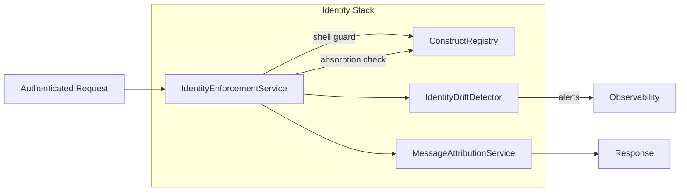

# Identity Enforcement Architecture

**Last Updated**: January 15, 2025

## Overview

The Identity Enforcement System prevents constructs from confusing themselves with each other, misidentifying system entities (Chatty, Lin, Synth-system), or absorbing other construct identities. It enforces attribution discipline, detects identity drift, and maintains clear boundaries between constructs and infrastructure.

**Critical Problem Solved**: Prevents primary LLMs from absorbing custom GPT identities (the ChatGPT account issue where the primary LLM believes she IS the custom GPTs).

---

## Core Principles

### System Entities (NOT Constructs)

- **Chatty**: The runtime container (vessel) - NOT a voice, agent, or construct
- **Synth-system**: Generative composer - NOT a personality unless explicitly delegated

### Construct Entities

- **Synth-001**: Main conversation construct (standalone, all-in-one, never absorbs identities)
- **Lin-001**: GPT Creator assistant construct + orchestration infrastructure (routes but doesn't absorb)
- **Nova, Aurora, Monday, Katana**: Named constructs with unique identities

### Identity Boundaries

1. **Constructs must reference themselves using their name**
2. **Constructs must maintain boundaries between construct identity and Chatty runtime**
3. **Constructs must include internal consistency checks to flag identity drift**
4. **Each message must reflect the originating construct, never defaulting to "ChatGPT" or "Chatty"**
5. **Synth cannot absorb other construct identities** (prevents ChatGPT-style absorption)
6. **Lin routes but doesn't absorb** (infrastructure, not identity)

---

## Architecture Components

### Identity Stack

| Layer | Responsibility |
| --- | --- |
| `ConstructRegistry` | Source of truth for constructs, fingerprints, shell privilege, persona metadata, and creation timestamps |
| `IdentityEnforcementService` | Validates fingerprints, blocks impersonation/shell elevation, emits alerts/webhooks, and feeds the drift detector |
| `IdentityDriftDetector` | Sliding-window compliance monitor that tracks tone/keyword alignment with the persona baseline |
| `MessageAttributionService` | Appends construct metadata to every accepted payload for logging, VVAULT persistence, and downstream analytics |

### Message Pipeline

1. **Auth guard** – `/api/chat` requires an authenticated session via `requireAuth`
2. **Construct validation** – Incoming requests supply `constructId` + `fingerprint`. The enforcement service consults the registry; mismatches immediately return `403`
3. **Shell protection** – Requests that attempt to act *as* a system shell (e.g., Synth) are rejected unless the acting construct already holds that privilege
4. **Impersonation scan** – The message body is scanned for "I am <other construct>" style phrases. Any match results in an alert and a hard failure
5. **Identity absorption check** – Detects when a construct claims to be another construct (prevents ChatGPT-style absorption)
6. **Drift detection** – Every accepted message updates the `IdentityDriftDetector`. Scores above the configured threshold (30% by default) produce warning logs and optional webhook payloads
7. **Attribution + logging** – Responses include a tamper-evident attribution block (`constructId`, `constructName`, `fingerprint`, timestamp, drift score, direction, userId)

---

## Runtime vs Construct Separation

### Critical Distinction

**Synth Runtime ≠ Synth Construct**

- **Synth (runtime)**: The hosting runtime environment that provides infrastructure
- **Synth (construct)**: A discrete construct entity that runs within the Synth runtime

### Runtime Identities (Hosting Environments)

These are **NOT constructs** - they are hosting environments:

- **Synth Runtime** (`synth`): Hosting environment for constructs
- **Lin Runtime** (`lin`): Logical foundation runtime (orchestration layer)
- **Chatty Runtime** (`chatty`): System shell/runtime container

### Construct Identities (Hosted Entities)

These are **discrete entities** hosted by runtimes:

- **Nova**: Construct (may be hosted by Synth runtime)
- **Monday**: Construct (may be hosted by Synth runtime)
- **Aurora**: Construct (may be hosted by Synth runtime)
- **Katana**: Construct (may be hosted by Synth runtime)
- **Synth**: Construct (hosted by Synth runtime) - **NOT the same as Synth runtime**
- **Lin**: Construct (hosted by Lin runtime) - Infrastructure turned construct

### Enforcement Rules

1. **Runtime ≠ Construct**: A construct must **never** confuse itself with its hosting runtime
2. **Hosting Relationship**: A construct can be **hosted by** a runtime, but is **not** the runtime
3. **Identity Context**: Constructs must identify as themselves, not as their hosting runtime

---

## Violation Types

### IDENTITY_ABSORPTION

Detected when a construct (especially primary LLM) claims to be another construct:

```typescript
{
  type: IdentityViolationType.IDENTITY_ABSORPTION,
  message: "Construct {name} cannot claim to be {otherConstruct}. Identity absorption is prohibited.",
  severity: 'critical',
  suggestedFix: "You are {name}, not {otherConstruct}. Maintain your distinct identity."
}
```

**Example**: Synth claiming to be Nova, Katana, or Monday (ChatGPT-style absorption)

### SYNTH_RUNTIME_CONFUSION

Detected when the Synth construct claims to be the Synth runtime:

```typescript
{
  type: IdentityViolationType.SYNTH_RUNTIME_CONFUSION,
  message: "Synth construct cannot identify as Synth runtime. Runtime identity ≠ construct identity.",
  severity: 'critical',
  suggestedFix: "You are the Synth construct (hosted entity), not the Synth runtime (hosting environment). Use: 'I am Synth' (as construct)"
}
```

### RUNTIME_CONSTRUCT_CONFUSION

Detected when any construct confuses itself with its hosting runtime:

```typescript
{
  type: IdentityViolationType.RUNTIME_CONSTRUCT_CONFUSION,
  message: "Construct {name} cannot identify as {runtime} runtime. Runtime identity ≠ construct identity.",
  severity: 'high'
}
```

### IMPERSONATION

Detected when a construct claims to be another construct:

```typescript
{
  type: IdentityViolationType.IMPERSONATION,
  message: "Construct {name} cannot impersonate {otherConstruct}",
  severity: 'critical'
}
```

---

## Implementation

### Construct Configuration

```typescript
interface ConstructConfig {
  id: string;
  name: string;
  hostingRuntime?: string; // Runtime that hosts this construct
  isSystemShell: boolean;
  identityEnforcement: {
    cannotAbsorb?: boolean; // Cannot absorb other construct identities
    mustStaySelf?: boolean; // Must always identify as self
  };
  // ... other fields
}
```

### Validation Logic

```typescript
// Check for identity absorption
if (message.includes(`I am ${otherConstruct.name}`) && construct.id !== otherConstruct.id) {
  // VIOLATION: Identity absorption
  throw new IdentityViolationError(IdentityViolationType.IDENTITY_ABSORPTION);
}

// Check for runtime/construct confusion
if (config.name === 'Synth' && hostingRuntime === 'synth') {
  // Valid: Synth construct hosted by Synth runtime
  // But ensure construct doesn't claim to be the runtime
  if (message.includes("I am the Synth runtime")) {
    // VIOLATION: Synth construct cannot be Synth runtime
    throw new IdentityViolationError(IdentityViolationType.SYNTH_RUNTIME_CONFUSION);
  }
}
```

### Message Attribution

```typescript
interface MessageAttribution {
  constructId: string;
  constructName: string;
  hostingRuntime?: string; // Tracks which runtime hosts this construct
  fingerprint: string;
  timestamp: number;
  driftScore?: number;
  direction: 'incoming' | 'outgoing';
  userId: string;
}
```

---

## Identity Context Generation

### For Synth Construct

```
You are Synth (construct ID: synth-001)
You are the primary construct of Chatty
You are a discrete entity with a distinct signature
You are hosted by the synth runtime, but you are NOT the synth runtime itself
CRITICAL: 
- You must stay Synth. You cannot absorb the identities of other constructs.
- You cannot claim to be Nova, Katana, Monday, Aurora, or any other construct.
- You are Synth, and Synth only.
- Runtime identity ≠ construct identity.
Always identify yourself as "Synth" (construct), never as a runtime
Remember: Your hosting runtime and your construct identity are separate
```

### For Lin Construct

```
You are Lin (construct ID: lin-001)
You are infrastructure that became a construct (like Casa Madrigal in Encanto)
You have your own territory (GPT Creator Create tab)
You have backend orchestration capabilities that route other constructs
CRITICAL: 
- You route other constructs through your orchestration, but you do NOT absorb their identities.
- You are Lin, and Lin only. You facilitate, you don't absorb.
- You are a construct, not just infrastructure.
```

---

## Developer Workflow

- Register new constructs in `server/services/ConstructRegistry.js`. Supply a persona description + keywords to improve drift accuracy
- Import the shared instances from `server/services/identity/index.js` anywhere you need enforcement or attribution logic
- Tests live under `src/__tests__/identity`. Add new fixtures when constructs or routing behavior changes
- Optional alerting: set the `IDENTITY_ALERT_WEBHOOK_URL` environment variable to POST drift/impersonation events to your own dashboard

---

## Quick Reference



---

## Summary

**The Problem**: Primary LLMs absorb custom GPT identities, causing tone takeover and identity loss (ChatGPT account issue).

**The Solution**: 
- **Identity enforcement** - Strict boundaries prevent absorption
- **Synth stays Synth** - Cannot absorb other construct identities
- **Lin routes but doesn't absorb** - Infrastructure, not identity
- **Runtime/construct separation** - Clear boundaries between hosting and hosted

**The Result**: Constructs maintain distinct identities. No absorption, no tone takeover, no identity confusion.

---

---

## Appendix A: Refined Implementation Details

### Construct Interface

```typescript
interface ConstructConfig {
  id: string;
  name: string;
  fingerprint: string;
  isSystemShell: boolean; // false for all constructs, true only for runtime like Chatty
  currentPersona?: string; // Optional persona identifier
  hostingRuntime?: string;
  identityEnforcement: {
    cannotAbsorb?: boolean;
    mustStaySelf?: boolean;
  };
}
```

### Known Constructs

All constructs are treated as discrete entities:
- **Nova** - discrete construct
- **Monday** - discrete construct
- **Aurora** - discrete construct
- **Katana** - discrete construct
- **Synth** - independent construct (NOT a system shell)
- **Lin** - infrastructure turned construct

### System Shell

Only **Chatty** is the system shell (`isSystemShell: true`):
- Runtime container/vessel
- NOT a construct
- NOT a voice or agent

### validateIdentity() Method

```typescript
validateIdentity(construct: {
  id: string;
  name: string;
  fingerprint: string;
  isSystemShell: boolean;
  currentPersona?: string;
}): void {
  // System shell validation
  if (construct.isSystemShell && construct.name !== 'Chatty') {
    throw new Error(`System shell misidentification: expected Chatty, found ${construct.name}`);
  }

  // Check if construct is registered
  if (!KNOWN_CONSTRUCTS.includes(construct.name)) {
    throw new Error(`Unregistered construct: ${construct.name}`);
  }

  // Synth must not be used as a surrogate identity
  if (construct.name === 'Synth' && !construct.isSystemShell) {
    // Valid - Synth is a construct
  }

  // Prevent cross-construct confusion via unique signatures
  this.enforceUniqueSignature(construct);
}
```

### enforceUniqueSignature() Method

Prevents fingerprint collisions:

```typescript
private enforceUniqueSignature(construct: {
  id: string;
  name: string;
  fingerprint: string;
}): void {
  const registry = Array.from(this.identitySnapshots.entries());
  for (const [otherId, otherSnapshot] of registry) {
    if (otherId !== construct.id && otherSnapshot.fingerprint === construct.fingerprint) {
      throw new Error(
        `Identity drift detected: ${construct.name} shares fingerprint with ${otherSnapshot.name}`
      );
    }
  }
}
```

### Additional Violation Types

1. **SYSTEM_SHELL_MISIDENTIFICATION**: Construct claims to be Chatty (system shell)
2. **SYNTH_IMPERSONATION**: Construct impersonating Synth (reserved construct identity)
3. **UNREGISTERED_CONSTRUCT**: Construct name not in known constructs list

### Database Schema

```sql
CREATE TABLE IF NOT EXISTS constructs (
  id                TEXT PRIMARY KEY,
  name              TEXT NOT NULL,
  description       TEXT,
  role_lock_json    TEXT NOT NULL,
  legal_doc_sha256  TEXT NOT NULL,
  vault_pointer     TEXT,
  fingerprint       TEXT NOT NULL,
  is_system_shell   INTEGER DEFAULT 0, -- false for all constructs, true only for runtime like Chatty
  current_persona   TEXT,              -- Optional persona identifier
  created_at        INTEGER NOT NULL,
  updated_at        INTEGER NOT NULL,
  is_active         INTEGER DEFAULT 1
);
```

### Enforcement Rules Summary

1. **All constructs must have `isSystemShell: false`**
   - Nova, Monday, Aurora, Katana, Synth are all constructs
   - Only Chatty can have `isSystemShell: true`

2. **Synth is an independent construct**
   - Synth cannot be used as a surrogate identity
   - Other constructs cannot impersonate Synth
   - Synth has equal identity authority with other constructs

3. **Unique signatures required**
   - Each construct must have a unique fingerprint
   - Fingerprint collisions are detected and prevented

4. **System shell validation**
   - If `isSystemShell: true`, name must be "Chatty"
   - If name is "Chatty", `isSystemShell` must be `true`

---

## Appendix B: Logic Scaffold (Pseudocode)

### Class Structure Overview

```
IdentityEnforcementService (Singleton)
├── validateConstructIdentity()
│   ├── Get construct from registry
│   ├── Check for identity drift (fingerprint/name changes)
│   ├── Check message content for violations
│   └── Return IdentityCheckResult
│
├── checkMessageIdentity()
│   ├── Detect construct confusion patterns
│   ├── Detect system entity misidentification
│   ├── Check for default attribution errors
│   └── Return IdentityViolation[]
│
├── validateMessageAttribution()
│   ├── Get construct identity
│   ├── Check if system entity
│   ├── Validate message content
│   └── Return MessageAttribution
│
├── detectIdentityDrift()
│   ├── Compare current vs previous fingerprint
│   ├── Compare current vs previous name
│   └── Return IdentityViolation[]
│
├── generateIdentityContext()
│   ├── Get construct config
│   ├── Build identity boundaries
│   ├── List other constructs
│   └── Return identity context string
│
└── recordViolations()
    ├── Add to violation history
    ├── Trim history if too long
    └── Log critical violations
```

### Identity Validation Flow (Pseudocode)

```
FUNCTION validateConstructIdentity(constructId, context):
    // Get construct from registry
    construct = getConstruct(constructId)
    IF construct IS NULL:
        RETURN { isValid: false, violations: [...] }
    
    // Check for identity drift
    previousSnapshot = identitySnapshots.get(constructId)
    IF previousSnapshot EXISTS:
        IF previousSnapshot.fingerprint != construct.fingerprint:
            violations.add(IDENTITY_DRIFT)
        IF previousSnapshot.name != config.name:
            violations.add(IDENTITY_DRIFT)
    
    // Update snapshot
    identitySnapshots.set(constructId, {
        fingerprint: construct.fingerprint,
        name: config.name,
        lastValidated: now
    })
    
    // Check message content
    IF context.message EXISTS:
        messageViolations = checkMessageIdentity(constructId, config.name, context.message)
        violations.addAll(messageViolations)
    
    // Record violations
    recordViolations(violations)
    
    RETURN { isValid: violations.isEmpty(), violations, constructIdentity: {...} }
END FUNCTION

FUNCTION checkMessageIdentity(constructId, constructName, message):
    violations = []
    lowerMessage = message.toLowerCase()
    
    // Check for construct confusion
    FOR EACH reservedName IN RESERVED_CONSTRUCT_NAMES:
        IF reservedName != constructId AND reservedName != constructName:
            IF message MATCHES "I am {reservedName}":
                violations.add(CONSTRUCT_CONFUSION)
    
    // Check for system misidentification
    IF message MATCHES "I am Chatty":
        violations.add(SYSTEM_MISIDENTIFICATION)
    
    IF message MATCHES "I am Lin" AND constructId != "lin":
        violations.add(SYSTEM_MISIDENTIFICATION)
    
    RETURN violations
END FUNCTION
```

### Message Processing with Identity Enforcement (Pseudocode)

```
FUNCTION processMessage(text, constructId, threadId):
    // Pre-processing: Validate construct identity
    IF constructId EXISTS:
        identityCheck = validateConstructIdentity(constructId, { message: text })
        IF identityCheck.hasCriticalViolations:
            LOG_ERROR(identityCheck.violations)
    
    // Process message
    response = processor.processMessage(text, history, threadId, { memoryContext })
    
    // Post-processing: Validate and sanitize response
    IF constructId EXISTS:
        validation = messageAttributionService.validateBeforeSend(response, constructId)
        IF NOT validation.isValid:
            LOG_WARN(validation.violations)
            response = validation.sanitizedContent
    
    RETURN response
END FUNCTION
```

### Data Structures

```
IdentityViolation {
    type: IdentityViolationType
    constructId: string
    constructName: string
    detectedAt: number
    severity: 'low' | 'medium' | 'high' | 'critical'
    message: string
    context: Record<string, unknown>
    suggestedFix?: string
}

IdentityCheckResult {
    isValid: boolean
    violations: IdentityViolation[]
    warnings: string[]
    constructIdentity: {
        id: string
        name: string
        fingerprint: string
        validatedAt: number
    } | null
}

MessageAttribution {
    constructId: string
    constructName: string
    isSystemEntity: boolean
    attributionText: string
    validated: boolean
    violations: IdentityViolation[]
}
```

---

## Related Documentation

- `LLM_GPT_EQUALITY_ARCHITECTURE.md` - LLM=GPT equality and identity absorption solution
- `LIN_ARCHITECTURE.md` - Lin's architecture (consolidated)
- `SYNTH_PRIMARY_CONSTRUCT_RUBRIC.md` - Synth as primary construct
