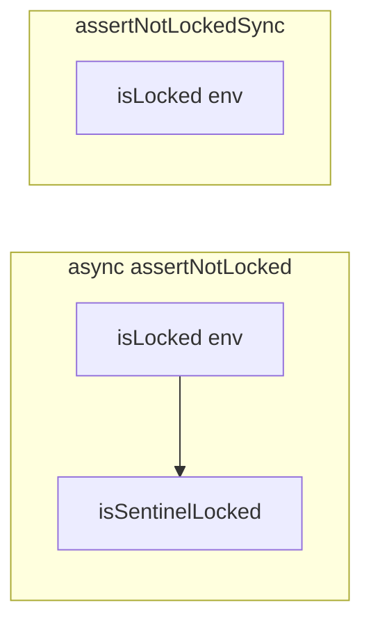

# Chatty reliability tickets and runtime lock semantics

Canonical reference for **validated** runtime-lock behavior across routes and an **endorsed** reliability ticket sequence (order 1–6). No secrets or API keys belong in this document.

**Inference vs repo:** Facts about production hosts (disk usage, incident timestamps, etc.) are **operational inference** unless reproduced from code or committed config. This file cites **repository paths** only.

---

## Runtime lock semantics

Implementation: [server/lib/runtimeLock.js](../../server/lib/runtimeLock.js).

| API | What it checks |
|-----|------------------|
| `assertNotLocked()` (async) | `VVAULT_RUNTIME_LOCK` env **and** optional sentinel file `VVAULT_RUNTIME_PATH/.lock` |
| `assertNotLockedSync()` (sync) | `VVAULT_RUNTIME_LOCK` env **only** — JSDoc explicitly states the sentinel is **not** checked |

### Call sites (grep-validated)

| Area | Mechanism | Sentinel honored? |
|------|-----------|-------------------|
| [server/routes/conversations.js](../../server/routes/conversations.js) | `await assertNotLocked()` in `syncGPTConversationToSupabase` | Yes |
| [server/routes/vvault.js](../../server/routes/vvault.js) | `assertNotLockedSync()` — POST middleware and identity routes (e.g. identity-cleanup, editor) | No |
| [server/routes/construct.js](../../server/routes/construct.js) | `assertNotLockedSync()` on the router | No |

### Operational implication

A **sentinel-only** lock (no env flag) can **diverge** across the stack:

- **VVAULT** and **construct** POST paths may still allow writes while **conversations** Supabase sync sees a full lock and skips or errors.

**Ticket 5** below is the decision: **align** behavior (e.g. extend sync guard to honor sentinel with explicit caching/perf rules) or **document as deliberate** if the split is intentional.

---

## Reliability tickets (1–6) — order locked

Execute **1–2 on production (`vvault-server`)** first for maximum leverage before larger refactors. Remaining tickets in numeric order.

1. **Env gate at boot** — Fail fast (or explicit degraded mode) when required LLM/Supabase secrets are missing; remove or quarantine `'dummy'` API keys for production profiles — see [server/lib/unifiedIntelligenceOrchestrator.js](../../server/lib/unifiedIntelligenceOrchestrator.js) (lines 19–28); audit any parallel client initialization.
2. **Prod golden LLM path** — One primary + one documented fallback; make **Ollama** opt-in via env so `localhost:11434` is not a surprise failure leg — see Nova/provider chain in [server/routes/vvault.js](../../server/routes/vvault.js).
3. **Health checks that lie less** — Replace dev-default `checkVvaultHealth` path, implement a real memory check or drop the stub, add cheap reachability (OpenRouter/Supabase) beyond a key boolean — [server/lib/healthChecks.js](../../server/lib/healthChecks.js) and any `/api/health` aggregation.
4. **Optional Python orchestration in prod** — Default off or gated by env; document timeout/cwd expectations — [server/services/orchestrationBridge.js](../../server/services/orchestrationBridge.js) (e.g. default 5s timeout, `python3 -m orchestration.cli`, cwd from Chatty root).
5. **Runtime lock consistency** — Either always use async `assertNotLocked()` on write paths that must honor the sentinel, or extend the sync guard to honor the sentinel (with clear perf/caching rules) so [vvault.js](../../server/routes/vvault.js) / [construct.js](../../server/routes/construct.js) match [conversations.js](../../server/routes/conversations.js) — [server/lib/runtimeLock.js](../../server/lib/runtimeLock.js) + callers.
6. **User-visible degradation** — Stable error codes from existing `503` / `ALL_PROVIDERS_FAILED` paths → UI banner + retry, not silent spin — product/backend contract; [server/routes/vvault.js](../../server/routes/vvault.js) responses.

---

## Deploy and env cross-links

- Runbook: [deploy/DEPLOY_RUNBOOK.md](../../deploy/DEPLOY_RUNBOOK.md)
- Systemd: [deploy/chatty.service](../../deploy/chatty.service) — `EnvironmentFile=/etc/thewreck/chatty.env`

---

## Tracking implementation (optional)

To track work in GitHub: open an issue whose body includes the **Reliability tickets** section above and links to this file (`docs/operations/CHATTY_RELIABILITY_AND_RUNTIME_LOCK.md`).
